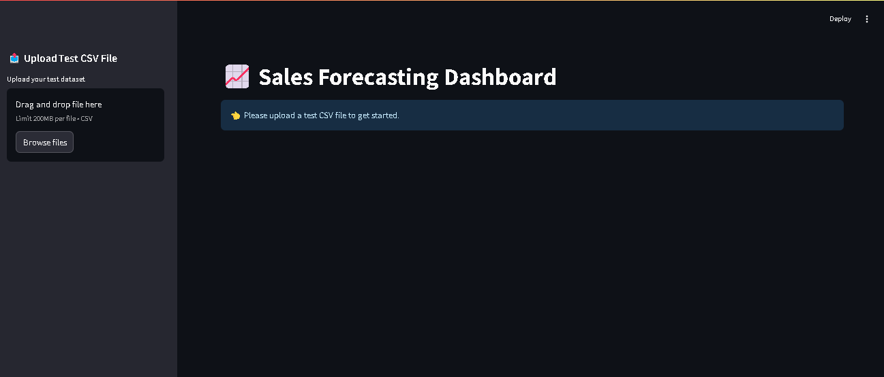
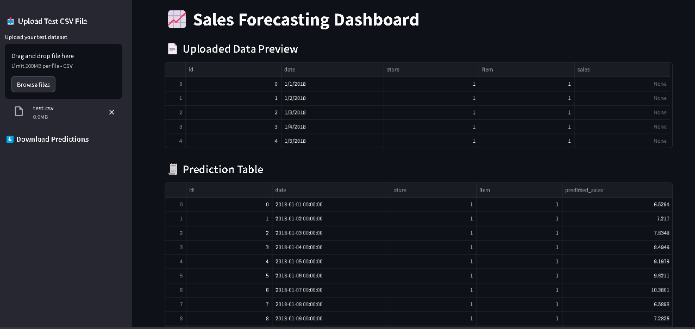
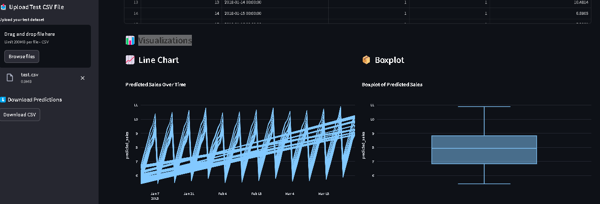
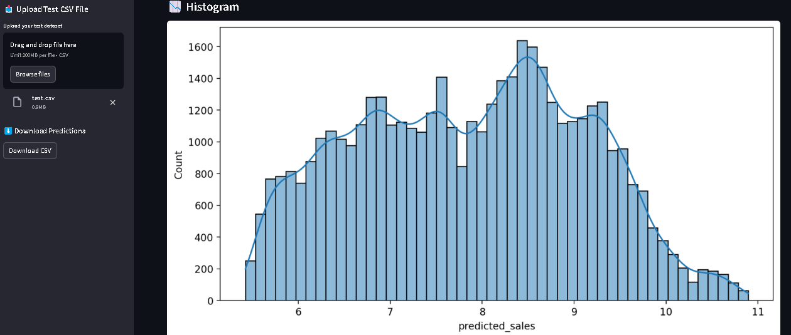

# 🏪 LSTM Sales Forecasting Dashboard

This Streamlit app uses a trained LSTM model to predict sales based on store, item, and date features. It offers an interactive way to upload your data, view predictions, analyze trends, and download results.

---

## 📂 How to Use

1. Upload a CSV file with the following columns:  
   - `date` (format: YYYY-MM-DD)  
   - `store` (integer or category)  
   - `item` (integer or category)  
   - `sales` (historical sales data)  

2. The app will:
   - Process your data using a pre-trained LSTM model.
   - Predict future sales.
   - Display key visualizations: line chart, boxplot, and histogram.
   - Allow downloading the prediction results as a CSV file.

---

## 🖼️ Screenshots


### 🏠 Home Page  


---

### 📋 Prediction Table  
Displays forecasted sales for each item/store combination.  


---


### 📊 Box Plot & 📈 Line Chart  
Visualizes sales distribution and trends over time on a single screen.  


---

### 📉 Histogram  
Displays the distribution of predicted sales values.  



---

## ⚙️ Setup

To run the app locally:

```bash
# Install required packages
pip install -r requirements.txt

# Run the Streamlit app
streamlit run app.py
